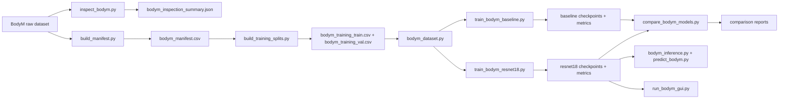

# FitScanCV


FitScanCV is a local-first computer vision project for predicting body measurements from paired silhouette masks.

The current project is built around the BodyM dataset and uses:
- paired `mask` and `mask_left` PNG silhouettes
- HWG metadata: gender, height, and weight
- 14 continuous body measurement targets
- a script-first pipeline for inspection, manifest building, subject-safe train/val splits, training, benchmarking, local inference, and a Tkinter accuracy explorer

The repo currently includes:
- raw BodyM dataset inspection and integrity checks
- a verified photo-level manifest
- subject-safe train/validation split artifacts
- a manifest-backed dataset loader and dataloader helpers
- a baseline light CNN and a stronger pretrained `torchvision` `resnet18` model
- training, evaluation, checkpointing, and model comparison scripts
- a local inference service and one-click prediction script
- a themed Tkinter desktop accuracy explorer


## Main idea

The current training contract is:
- input views: paired front and side silhouette masks
- metadata: `hwg_gender`, `hwg_height_cm`, `hwg_weight_kg`
- targets: all manifest columns beginning with `measurement_`

The canonical source of truth is the photo-level manifest:
- one row per unique `photo_id`
- repo-relative `mask_path` and `mask_left_path`
- joined subject-level HWG and measurement data
- `subject_key = "{split}::{subject_id}"` so subject identity is safe across splits

Current dataset counts:

| Split | Rows | Subjects |
| --- | ---: | ---: |
| `train` | 6134 | 2018 |
| `testA` | 1684 | 87 |
| `testB` | 1160 | 400 |
| total manifest | 8978 | 2505 |

The training workflow uses only source `split == "train"` and builds subject-safe workflow splits:

| Workflow Split | Rows | Subjects |
| --- | ---: | ---: |
| `train` | 5576 | 1816 |
| `val` | 558 | 202 |

`testA` and `testB` are kept as external holdouts.

## Pipeline

High-level flow:



What each stage is doing:

- `bodym_inspection_summary.json`
  Raw dataset structure and integrity summary for `train`, `testA`, and `testB`.
- `bodym_manifest.csv`
  Canonical photo-level manifest with paired mask paths, HWG metadata, and 14 measurement targets.
- `bodym_training_train.csv` and `bodym_training_val.csv`
  Subject-safe workflow split artifacts built from source `train`.
- `bodym_dataset.py`
  Manifest-backed dataset loader used by both training and evaluation.
- `outputs/bodym_baseline/`
  Baseline light-CNN checkpoints, training history, and evaluation summaries.
- `outputs/bodym_resnet18/`
  Stronger `resnet18` checkpoints, training history, holdout evaluations, and benchmark reports.

## Current model setup

Two model families exist right now:

- baseline:
  dual-view late-fusion light CNN with HWG metadata fusion
- stronger model:
  dual-view late-fusion pretrained `resnet18` with single-channel first-layer adaptation and HWG metadata fusion

Current default configs:

- baseline config:
  [configs/bodym_baseline.yaml](/C:/Users/niket/OneDrive/Desktop/Coding/ML/FitScanCV/configs/bodym_baseline.yaml)
- stronger config:
  [configs/bodym_resnet18.yaml](/C:/Users/niket/OneDrive/Desktop/Coding/ML/FitScanCV/configs/bodym_resnet18.yaml)

The stronger `resnet18` checkpoint is the current model family carried forward for local inference and the desktop explorer.

## Current metrics

Saved mean-MAE results for the current checkpoints:

| Split | Baseline mean MAE | ResNet18 mean MAE | Delta (`resnet18 - baseline`) | Winner |
| --- | ---: | ---: | ---: | --- |
| `val` | 2.2307 | 1.9681 | -0.2626 | `resnet18` |
| `testA` | 2.1574 | 2.1236 | -0.0338 | `resnet18` |
| `testB` | 2.4261 | 2.2206 | -0.2055 | `resnet18` |

Reference artifacts:
- [outputs/bodym_baseline/best_metrics.json](/C:/Users/niket/OneDrive/Desktop/Coding/ML/FitScanCV/outputs/bodym_baseline/best_metrics.json)
- [outputs/bodym_resnet18/best_metrics.json](/C:/Users/niket/OneDrive/Desktop/Coding/ML/FitScanCV/outputs/bodym_resnet18/best_metrics.json)
- [outputs/model_comparison/val/comparison_report_val.json](/C:/Users/niket/OneDrive/Desktop/Coding/ML/FitScanCV/outputs/model_comparison/val/comparison_report_val.json)
- [outputs/bodym_resnet18/benchmarks/testA/comparison_report_testA.json](/C:/Users/niket/OneDrive/Desktop/Coding/ML/FitScanCV/outputs/bodym_resnet18/benchmarks/testA/comparison_report_testA.json)
- [outputs/bodym_resnet18/benchmarks/testB/comparison_report_testB.json](/C:/Users/niket/OneDrive/Desktop/Coding/ML/FitScanCV/outputs/bodym_resnet18/benchmarks/testB/comparison_report_testB.json)

## Repo structure

- `data/`
  Raw BodyM assets plus interim inspection, manifest, and workflow split artifacts.
- `configs/`
  YAML configs for the baseline and stronger training runs.
- `scripts/`
  End-to-end pipeline scripts, dataset loader, inference, and desktop launcher.
- `scripts/models/`
  Model definitions, training runner, evaluation, and benchmarking utilities.
- `scripts/inference/`
  Reusable local inference service.
- `scripts/gui/`
  Tkinter accuracy explorer.
- `tests/`
  Dataset, split, model, training, inference, benchmarking, and GUI tests.
- `outputs/`
  Checkpoints, training history, evaluation summaries, and comparison reports.

## Main artifacts

Inspection:
- `data/interim/bodym_inspection_summary.json`

Canonical data:
- `data/interim/bodym_manifest.csv`

Workflow splits:
- `data/interim/bodym_training_train.csv`
- `data/interim/bodym_training_val.csv`
- `data/interim/bodym_training_split_summary.json`

Baseline outputs:
- `outputs/bodym_baseline/best.pt`
- `outputs/bodym_baseline/last.pt`
- `outputs/bodym_baseline/history.json`
- `outputs/bodym_baseline/best_metrics.json`
- `outputs/bodym_baseline/evaluation_summary_val.json`
- `outputs/bodym_baseline/evaluation_summary_testA.json`
- `outputs/bodym_baseline/evaluation_summary_testB.json`

Stronger-model outputs:
- `outputs/bodym_resnet18/best.pt`
- `outputs/bodym_resnet18/last.pt`
- `outputs/bodym_resnet18/history.json`
- `outputs/bodym_resnet18/best_metrics.json`
- `outputs/bodym_resnet18/evaluation_summary_val.json`
- `outputs/bodym_resnet18/evaluation_summary_testA.json`
- `outputs/bodym_resnet18/evaluation_summary_testB.json`

Benchmarking:
- `outputs/model_comparison/val/comparison_report_val.json`
- `outputs/model_comparison/val/per_target_deltas_val.csv`
- `outputs/bodym_resnet18/benchmarks/testA/comparison_report_testA.json`
- `outputs/bodym_resnet18/benchmarks/testB/comparison_report_testB.json`

## Environment setup

Create a fresh environment and install the current dependencies manually:

```bash
python -m venv .venv
.venv\Scripts\activate
pip install pandas torch torchvision scikit-learn pyyaml pillow pytest
```

The project declares:
- Python `>= 3.11`

Important note for the desktop GUI:
- `tkinter` must be available in your Python installation
- on Windows, the GUI also requires a Python build with a working Tcl/Tk runtime
- if Tcl/Tk is missing, `scripts/run_bodym_gui.py` will exit with a clear startup error

## Build the current pipeline

Run the current offline workflow in this order:

```bash
python scripts/inspect_bodym.py
python scripts/build_manifest.py
python scripts/build_training_splits.py
python scripts/train_bodym_baseline.py
python scripts/train_bodym_resnet18.py
python scripts/compare_bodym_models.py
```

What those commands do:

1. `scripts/inspect_bodym.py`
   Verifies the raw BodyM structure and writes the inspection summary.
2. `scripts/build_manifest.py`
   Builds the canonical photo-level manifest from raw CSVs plus paired PNG paths.
3. `scripts/build_training_splits.py`
   Builds subject-safe `train` and `val` CSVs from source `train`.
4. `scripts/train_bodym_baseline.py`
   Trains the light-CNN baseline with the default baseline config.
5. `scripts/train_bodym_resnet18.py`
   Trains the stronger pretrained `resnet18` model.
6. `scripts/compare_bodym_models.py`
   Compares the baseline and stronger checkpoints on one manifest/split.

## Evaluate a checkpoint

Evaluate the stronger model on validation:

```bash
python scripts/models/evaluate_bodym.py --config configs/bodym_resnet18.yaml --checkpoint outputs/bodym_resnet18/best.pt
```

Evaluate the stronger model on holdouts:

```bash
python scripts/models/evaluate_bodym.py --config configs/bodym_resnet18.yaml --checkpoint outputs/bodym_resnet18/best.pt --manifest-path data/interim/bodym_manifest.csv --split testA
python scripts/models/evaluate_bodym.py --config configs/bodym_resnet18.yaml --checkpoint outputs/bodym_resnet18/best.pt --manifest-path data/interim/bodym_manifest.csv --split testB
```

## Compare baseline vs stronger model

Validation comparison:

```bash
python scripts/compare_bodym_models.py
```

Holdout comparison examples:

```bash
python scripts/compare_bodym_models.py --manifest-path data/interim/bodym_manifest.csv --split testA --output-dir outputs/model_comparison/testA
python scripts/compare_bodym_models.py --manifest-path data/interim/bodym_manifest.csv --split testB --output-dir outputs/model_comparison/testB
```

## Run local prediction

Smoke prediction from the first validation row:

```bash
python scripts/predict_bodym.py
```

Explicit prediction from BodyM-style mask images:

```bash
python scripts/predict_bodym.py --front-image <mask.png> --side-image <mask_left.png> --hwg-gender male --hwg-height-cm 180 --hwg-weight-kg 78
```

The current inference contract expects BodyM-compatible silhouette masks, not arbitrary phone photos.

## Run the desktop explorer

Launch the Tkinter accuracy explorer:

```bash
python scripts/run_bodym_gui.py
```

The explorer currently:
- browses `val`, `testA`, and `testB`
- shows paired masks, HWG metadata, and the 14 target errors for the selected sample
- uses the tuned `resnet18` checkpoint by default
- is intended for local inspection and qualitative evaluation

## Tests

Run the current test suite:

```bash
python -m pytest tests -q -p no:cacheprovider
```

The repo currently includes tests for:
- manifest-backed dataset loading
- train/val split building
- baseline and stronger models
- training and evaluation
- benchmarking
- local inference
- Tkinter GUI controller and launcher behavior

## Current limitations

- inputs are still BodyM-style silhouette masks only
- there is no real-photo segmentation or photo-to-mask preprocessing yet
- the project is local-file and local-GUI first; there is no API layer yet
- the current GUI is an evaluation workbench, not a general user-facing app
- there is no Docker packaging or dependency lockfile yet
- the repo is still script-first rather than a packaged library/application

## Possible next work

- real-photo preprocessing and segmentation
- export tools from the desktop explorer
- richer error-analysis views inside the GUI
- API layer once the local inference contract is fully settled
- packaging and dependency management cleanup
